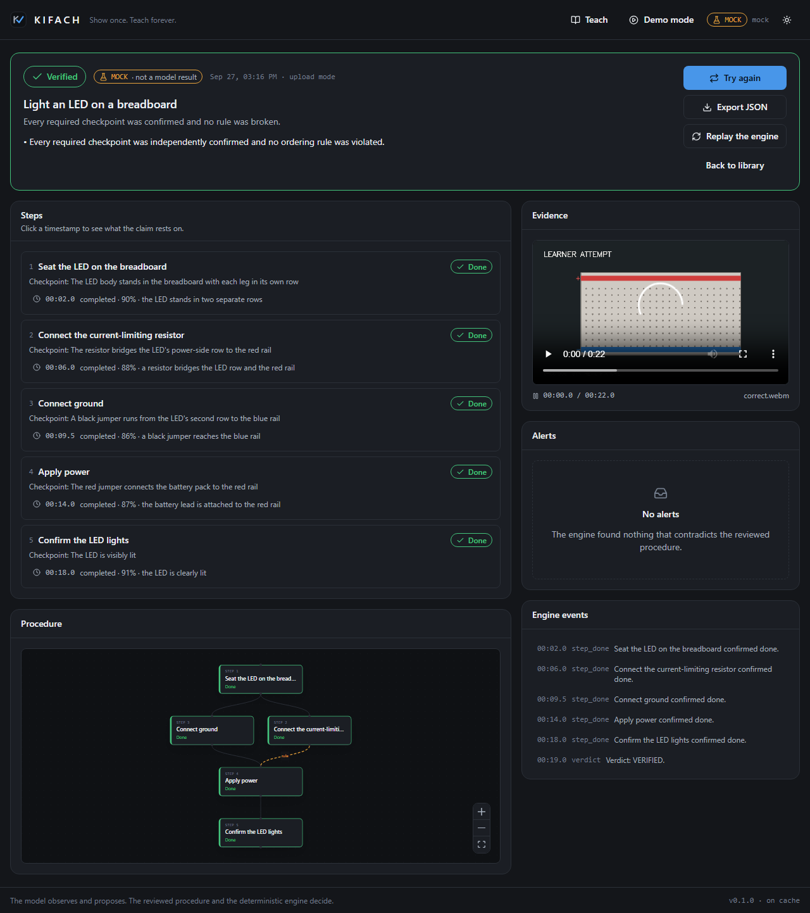
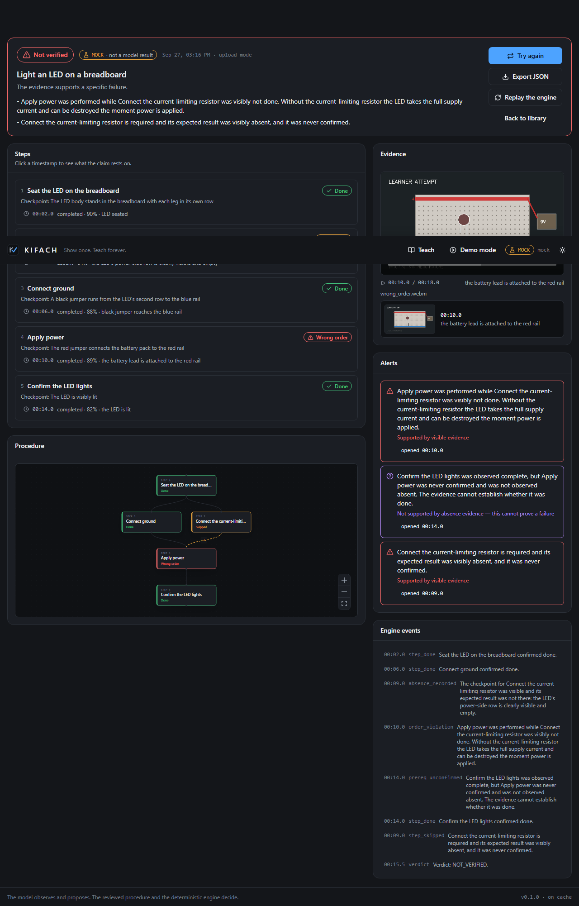

<div align="center">


### Show once. Teach forever.

</div>

An expert demonstrates a physical task once. KIFACH watches the recording,
writes down only what it can actually see, and proposes a procedure. The expert
reviews, corrects, and publishes it. A learner then records an attempt, and a
deterministic engine assesses it against the published procedure — linking every
conclusion to the frame it came from, and saying plainly when the footage cannot
decide.



---

## The problem

Expertise lives in hands, not documents. Writing a procedure down is slow,
writing a *good* one is rare, and checking that someone followed it means a
supervisor standing over them. The tempting fix — point a model at the video and
ask "did they do it right?" — fails for a specific reason: the model's mistakes
and the judgement are the same act, so nobody can tell a misread frame from a
real error.

## The loop

```
expert recording ──► timestamped observations ──► draft procedure
                                                        │
                                            expert review & publish
                                                        │
learner recording ──► timestamped observations ──► deterministic engine
                                                        │
                                       verdict + evidence + correction
```

KIFACH splits the act in two: **the model observes and proposes; the reviewed
procedure and deterministic code decide.** The model is never asked whether an
attempt passed. It is asked what is visible in four seconds of video, and told to
say so when it cannot tell.

That split is what makes the result inspectable. Every verdict comes with the
observation log it was computed from, and re-running that log through the engine
reproduces the same verdict, byte for byte — a button in the UI does exactly
this.

## What is real, and what is not

KIFACH labels the origin of every observation, everywhere it is shown:

| Badge | Meaning |
| --- | --- |
| `LIVE` | A real model call made during this run |
| `CACHED` | A genuine model response replayed from the on-disk cache |
| `MOCK` | Scripted offline output. **Not a model result.** |

Out of the box, with no credentials, KIFACH runs on `MOCK` and says so on every
screen. See [BUILD_REPORT.md](BUILD_REPORT.md) for exactly which model paths have
and have not been exercised against a live endpoint in this build.

## Features

- **Teach** — upload or record a demonstration; frames are sampled at their true
  source timestamps, grouped into overlapping windows, and described one window
  at a time, streamed to the browser over SSE.
- **Review** — a draft procedure is never publishable as-is. Every proposed
  ordering or safety rule must be confirmed or removed by a human, every step
  needs a visible checkpoint, and the dependency graph is validated for cycles
  with an error a person can act on.
- **Practice** — assess an uploaded attempt against a published procedure, with
  the graph, checklist, and alerts updating as each window is observed.
- **Verdict** — `VERIFIED`, `NOT VERIFIED`, or `INCONCLUSIVE`, each with its
  reasons and clickable evidence that seeks the source video.
- **Live mode** — the same pipeline over a webcam and a WebSocket, with stricter
  confirmation requirements than upload mode.
- **Demo Mode** — the complete loop offline with bundled fixtures, clearly
  labelled as scripted.

## The three verdicts, and why there are three

| Verdict | Means |
| --- | --- |
| `VERIFIED` | Every required checkpoint was confirmed and no rule was broken |
| `NOT_VERIFIED` | There is **supported** evidence of a failure or wrong order |
| `INCONCLUSIVE` | The evidence cannot establish completion or a specific failure |

The distinction that does the work is **missing evidence versus explicit
absence**. Never seeing the resistor is not evidence that the resistor is
missing. Only an `absent` observation — made while the checkpoint area was
visible and empty — can support a claim that a learner skipped a step. Everything
else lands in `INCONCLUSIVE`, with the reason stated.



## Step states

```
                    ┌──────────► skipped      (explicit absence evidence only)
                    │
pending ──► in_progress ──► done ──► (undone) ──► pending
                    │
                    ├──────────► violation    (wrong order, supported)
                    │                │
                    │                └──► resolved by undo → prerequisite → redo
                    └──────────► uncertain    (obscured, low confidence, or unconfirmed)
```

A wrong-order violation is corrected only by the full sequence: the violating
action undone, the missing prerequisite completed, and the violating action
performed again afterwards. Simply doing the prerequisite later does not clear
it.

## Architecture

```
browser (React + TypeScript)
  │  REST + SSE + WebSocket
  ▼
FastAPI
  ├── services/video.py .............. frame sampling at true source timestamps
  ├── providers/ ..................... NVIDIA NIM │ OpenAI-compatible │ mock
  │     └── cache.py ................. on-disk cache of genuine responses
  ├── services/skill_compiler.py ..... teach pipeline  → draft procedure
  ├── domain/skill_graph.py .......... validation, repair, review, publication
  ├── services/observation_extractor.py  verify pipeline → observation log
  └── domain/verifier.py ............. the deterministic engine (pure Python)
        │
        ▼
  data/ (JSON records + media, gitignored)
```

The engine has no network, disk, clock, or randomness. That is what makes replay
meaningful.

## Quickstart

Requires **Python 3.11+** and **Node 20+**. Works on Windows, macOS, and Linux.
No ffmpeg, no GPU, no credentials.

```sh
git clone <this repo> && cd KIFACH

python -m venv .venv
# Windows:        .venv\Scripts\activate
# macOS / Linux:  source .venv/bin/activate
python -m pip install -r backend/requirements.txt

npm --prefix frontend install
python scripts/make_synthetic_video.py     # bundled demo footage

python run.py --build                      # builds the frontend, then serves
```

Open <http://127.0.0.1:8000>. API docs are at `/docs`.

Afterwards, `python run.py` alone starts the app; `python run.py --check` prints
the active configuration without starting anything.

### Developing

```sh
python run.py --dev          # backend on :8000 with reload
npm --prefix frontend run dev # Vite on :5173, proxying /api and /samples
```

### Running against a real model

```sh
export NVIDIA_API_KEY=nvapi-...      # Windows: set NVIDIA_API_KEY=nvapi-...
python run.py
```

The provider badge in the header switches to `LIVE`, and responses are cached to
`data/cache/`. To demo without a network afterwards:

```sh
export KIFACH_CACHE=replay   # no network calls; cached results are labelled CACHED
```

## Configuration

| Variable | Default | What it does |
| --- | --- | --- |
| `KIFACH_PROVIDER` | *(auto)* | `nvidia`, `openai_compat`, or `mock`. Auto-selects NVIDIA when a key is present, otherwise mock |
| `NVIDIA_API_KEY` | — | Enables the NVIDIA NIM provider |
| `NVIDIA_BASE_URL` | `https://integrate.api.nvidia.com/v1` | NIM endpoint (point at a self-hosted NIM if you have one) |
| `OPENAI_COMPAT_BASE_URL` / `OPENAI_COMPAT_API_KEY` | — | Any OpenAI-compatible vision endpoint |
| `KIFACH_VLM_MODEL` | `nvidia/cosmos-reason2-8b` | Model id sent to the provider |
| `KIFACH_CACHE` | `on` | `on`, `off`, or `replay` (never calls the network) |
| `KIFACH_FPS` | `2.0` | Frame sampling rate |
| `KIFACH_FRAME_SIZE` | `768` | Long side of a sampled frame, in pixels |
| `KIFACH_JPEG_QUALITY` | `85` | Frame encoding quality |
| `KIFACH_WINDOW_SECONDS` | `4.0` | Analysis window length |
| `KIFACH_WINDOW_OVERLAP` | `1.0` | Overlap between consecutive windows |
| `KIFACH_MAX_IMAGES_PER_CALL` | `4` | Frames sent per provider call |
| `KIFACH_MAX_UPLOAD_MB` | `200` | Upload size limit |
| `KIFACH_TIMEOUT_S` | `90` | Per-request provider timeout |
| `KIFACH_MAX_RETRIES` | `3` | Retries on 429/5xx, with exponential backoff |
| `KIFACH_MAX_CONCURRENCY` | `2` | Concurrent provider calls |
| `KIFACH_TEMPERATURE` | `0.0` | Sampling temperature |
| `KIFACH_MIN_CONFIDENCE` | `0.6` | Below this, an observation cannot establish anything |
| `KIFACH_CONFIRMATIONS` | `1` | Independent confirmations needed in upload mode |
| `KIFACH_LIVE_CONFIRMATIONS` | `2` | Independent confirmations needed in live mode |
| `KIFACH_INDEPENDENT_GAP_S` | `1.0` | Minimum gap for two reports to count as independent |
| `KIFACH_DATA_DIR` | `./data` | Where media and records are written |

## Recording your own footage

Fixed top-down camera, even lighting, contrasting background, large components,
one action at a time with a brief pause and hands out of frame.
**[samples/RECORDING_GUIDE.md](samples/RECORDING_GUIDE.md)** has the full guide
and the six clips a complete demo needs.

## API

| Method | Path | Purpose |
| --- | --- | --- |
| GET | `/api/health` | App and provider status (no model call) |
| POST | `/api/health/provider-check` | Explicit connectivity test |
| POST | `/api/videos` | Upload media |
| GET | `/api/videos/{id}` | Media metadata and sampled frames |
| POST | `/api/skills/teach` | Start a teach job |
| GET | `/api/jobs/{job_id}/events` | SSE progress, resumable with `Last-Event-ID` |
| GET | `/api/jobs/{job_id}` | Whole job state, for recovery after a refresh |
| GET | `/api/skills` | List skills |
| GET / PUT | `/api/skills/{id}` | Read or edit a draft |
| GET | `/api/skills/{id}/validation` | Current validation issues |
| POST | `/api/skills/{id}/publish` | Validate and publish |
| DELETE | `/api/skills/{id}` | Delete a skill |
| POST | `/api/skills/{id}/attempts` | Start verification |
| GET | `/api/attempts` | List attempts |
| GET | `/api/attempts/{id}` | Full attempt, observations, and evidence |
| POST | `/api/attempts/{id}/replay` | Re-run the engine and compare |
| POST | `/api/attempts/{id}/media` | Attach a live session's recording |
| WS | `/api/live/{skill_id}` | Live observations and engine events |
| GET | `/api/media/{path}` | Serve media, restricted to the media root |

Errors always come back as `{"error": {"code": "...", "message": "..."}}`.

## Tests

```sh
python -m pytest backend/tests -q                        # backend
python -m pytest backend/tests --cov=app --cov-report=term
npm --prefix frontend run typecheck
npm --prefix frontend run lint
npm --prefix frontend test                               # vitest
npm --prefix frontend run e2e                            # Playwright (starts the app)
python scripts/gen_types.py --check                      # frontend/backend contract
```

Measured results for this build are in [BUILD_REPORT.md](BUILD_REPORT.md).

## Project structure

```
backend/app/
  api/          REST, SSE, and WebSocket routes
  domain/       models, graph validation, the deterministic engine
  providers/    NVIDIA, OpenAI-compatible, mock, response cache, scenarios
  prompts/      prompt text and the JSON shapes answers must match
  services/     media processing, teach/verify pipelines, jobs, storage
backend/tests/  110 tests
frontend/src/   React + TypeScript (types generated from the backend models)
frontend/e2e/   Playwright specs that drive the delivered app
samples/        bundled demo footage + RECORDING_GUIDE.md
scripts/        fixture generator, type generator
docs/           screenshots and working notes
data/           runtime media and records (gitignored)
run.py          one-command start
```

## Limitations

- **No live model run is included in this build.** No API credentials were
  available, so every result in this repository is `MOCK`. The real provider path
  is implemented and tested offline against a stub transport, but its perception
  quality on real footage is unmeasured. [BUILD_REPORT.md](BUILD_REPORT.md) states
  this precisely.
- **The bundled footage is drawn, not filmed.** The fixtures exercise every
  branch deterministically; they say nothing about how a VLM handles real
  breadboards, hands, and glare.
- **Demo Mode only answers for footage it can identify.** The mock refuses
  unknown media rather than inventing an assessment.
- **Live mode needs a real provider.** The scripted offline provider has no
  answer for a live camera, and the UI says so.
- **Prototype storage.** JSON files under `data/`, no authentication, no
  multi-user isolation, no migrations.
- **One task at a time.** The engine is general, but the mock scenarios and the
  demo are built around the reference LED circuit.

## Next steps

- Validate the NVIDIA path against real footage and record where perception
  actually fails, per step and per lighting condition.
- Let the expert mark a checkpoint region on a frame, so `absent` observations
  become far more reliable than a whole-frame judgement.
- Group attempts by learner, and show where a cohort gets stuck.
- Replace JSON files with SQLite once more than one person uses an instance.

## Use cases

Industrial onboarding and work instructions, lab and clinical procedure practice,
trade apprenticeships, safety-critical checklists, field-service training, and
anywhere a procedure exists mostly in one person's hands.

## Credits

Built for the GOMYCODE "Come Build with AI" hackathon in Morocco, in partnership
with NVIDIA. Vision providers: NVIDIA NIM and any OpenAI-compatible endpoint.
Frame handling with OpenCV; interface with React, Tailwind, `@xyflow/react`, and
Lucide icons.

## License

MIT — see [LICENSE](LICENSE).
